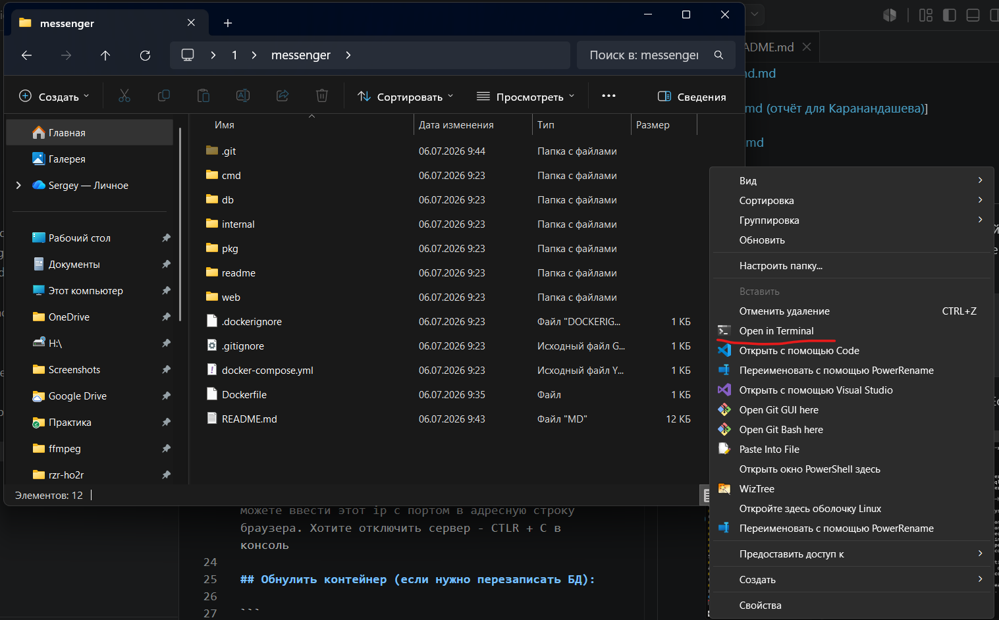

# Роадмапы и планы (на них можно нажимать)
[Backend.md](readme/Backend.md)

[Frontend.md](readme/Frontend.md)

[Report.md (отчёт для Каранандашева)](readme/Report.md)]

[Design.md](readme/Design.md)


## Запуск:

Установите Docker Destop, потом при запущенном Docker зайдите консолью в корень каталога нашего проекта messenger. Чтобы быстро это сделать ПКМ + Shift по папке и выберите пункт открыть в терминале (на Windows 10 будет PowerShell).



```

docker compose up --build

```
Первый раз будет продолжительно запускаться. Если видите эту строку, то всё работает:

Нажмите в консоли по адресу мышкой через CTRL, либо можете введите его с портом в адресную строку браузера. Хотите отключить сервер - CTLR + C в консоль

## Обнулить контейнер (если нужно перезаписать БД):

```

docker compose down -v

```
## Если нужно посмотреть БД

Подключаемся на 3307 порт, чтобы не конфликтовал с локальным MySQL
### Консоль
```
mysql -h 127.0.0.1 -P 3307 -u root -p
# введите пароль: rootpass
```
### Графический интерфейс
- Адрес: 127.0.0.1 или localhost
- Порт 3307
- Пользователь: root
- Пароль: rootpass

# Описание
<details>
<summary>Описание проекта от Ильназа (раскрывается)</summary>
окей, как я это вижу
вот что уже реализовано
сайт - мессенджер с элементами социальной сети, есть стена пользователя, на своей стене он может оставлять записи и грузить фото, можно добавлять в друзья, пользователь может написать только своему другу, можно просматривать стену другого пользователя, ну и соответственно общение между пользователями, общение сделано через сокеты, авторизация - через сессии

мы не собираемся делать соц сеть, грубо говоря у нас из соц сети только стена пользователя, итоговый продукт - удобный сервис, в котором студенты смогут полноценно общаться, создавать беседы, обмениваться фото\видео в чатах и тд, одним словом будем  создавать сервис, которым мы бы сами пользовались
</details>


# Что дописать

### 1. Регистрация, авторизация и профиль

* **План (по отчёту):** Реализовать базовую систему авторизации, личный кабинет с профилем (имя, группа, описание) и загрузкой аватара.


* [x] **Текущее состояние:** **Реализовано полностью.** В коде присутствует регистрация (с хешированием паролей), авторизация через сессии, а также возможность изменения имени, информации «о себе» и загрузки аватара.

### 2. Стена (публикации)

* **План (по отчёту):** Возможность вести короткие публикации или заметки на «стене». На макете профиля (Рисунок 1) отображается лента постов с возможностью ставить лайки (иконка сердца).


* [ ] **Текущее состояние:** **Реализовано частично.** Пользователь может создавать посты, прикреплять к ним изображения, а также редактировать и удалять их. Однако функционал **лайков**, представленный на макетах, в базе данных и на сервере в данный момент отсутствует.


### 3. Система друзей и контактов

* **План (по отчёту):** Создание списка контактов/друзей. Макет раздела «Друзья» (Рисунок 4) подразумевает разделение на «Все друзья» и «Заявки» (ожидающие подтверждения), а также отображение статуса пользователя («В сети» / «Не в сети») и принадлежности к факультету.


* [ ] **Текущее состояние:** **Реализовано с упрощениями.**
* Поиск и добавление в друзья работают, но **система заявок отключена на бэкенде**: при отправке запроса статус в базе данных жестко задается как `"accepted"` (принят), минуя этап подтверждения вторым пользователем.
* Отображение статуса «В сети» на данный момент не реализовано.


### 4. Мессенджер (Личные чаты)

* **План (по отчёту):** Личные чаты в реальном времени. На макетах (Рисунок 2 и 3) показаны списки диалогов с превью последнего сообщения, групповые беседы, счетчики непрочитанных сообщений и возможность прикреплять файлы (изображения/документы) к сообщениям.


* [ ] **Текущее состояние:** **Реализован только фронтенд.**
* На клиенте (во Vue-скриптах) написана логика подключения по WebSocket, отправки сообщений, а также их редактирования и удаления.
* Однако **на стороне сервера (Go) функционал полностью отсутствует**. Нет обработчика вебсокетов `/ws`, нет эндпоинта для получения истории сообщений `/api/AllMessage`.
* Групповые чаты и прикрепление файлов в чате пока не заложены даже на уровне интерфейса.


### 5. Пользовательский интерфейс (UI/UX)

* **План (по отчёту):** В макетах (Рисунки 1–4) заложена строгая структура с фиксированной левой (боковой) навигационной панелью (логотип «ГУАП», навигация по разделам) и основной рабочей областью.


* [ ] **Текущее состояние:** Фактическая верстка (HTML/CSS) **отличается от концептуальных макетов**. Вместо левой навигационной панели используется верхняя «шапка» (header) с кнопками, а список друзей вынесен в правую боковую панель (sidebar) внутри профиля. Сами разработчики в отчёте отмечали, что финальная визуальная концепция может отличаться от иллюстраций, что и произошло на практике.


# Что реализовано

### 🛠 Стек технологий

* **Бэкенд:** Go (стандартная библиотека `net/http` для маршрутизации).


* **База данных:** MySQL 8.0, драйвер `[github.com/go-sql-driver/mysql](https://github.com/go-sql-driver/mysql)`.


* **Фронтенд:** HTML5, CSS3, JavaScript, Vue.js 3 (Options API).


* **Аутентификация:** Хеширование паролей с помощью `golang.org/x/crypto/bcrypt`, сессии через `[github.com/gorilla/sessions](https://github.com/gorilla/sessions)`.


* **Инфраструктура:** Docker и Docker Compose для контейнеризации приложения и базы данных.


### ⚙️ Основной функционал

**1. Аутентификация и безопасность**

* **Регистрация:** Пользователь может зарегистрироваться, указав почту, пароль, имя и пол. Пароли безопасно хешируются перед сохранением в БД.


* **Авторизация:** Вход по логину (email) и паролю. При успешном входе создается защищенная cookie-сессия.


* **Защита маршрутов:** Реализован middleware `RequireAuth`, который закрывает доступ к API и внутренним страницам для неавторизованных пользователей.


**2. Управление профилем пользователя**

* **Просмотр профиля:** Отображение аватара, имени, пола и информации "о себе".


* **Редактирование данных:** Возможность изменить имя и описание профиля.


* **Загрузка аватара:** Пользователь может загрузить изображение с компьютера, которое сохраняется на сервере в папке `web/static/uploads/avatars/`.


**3. Система "Стены" (Микроблог)**

* Пользователи могут публиковать записи на своей стене.


* Пост может содержать текстовый заголовок, текст и прикрепленное изображение (которое также загружается на сервер).


* Реализованы функции удаления и редактирования своих постов.


**4. Система друзей**

* **Поиск:** Поиск других пользователей по имени (через модальное окно на фронтенде).


* **Добавление:** Отправка запроса на добавление в друзья.


* **Просмотр:** Отображение списка добавленных друзей на боковой панели (сайдбаре).


* **Чужой профиль:** Возможность перейти в профиль другого человека, посмотреть его стену и список его друзей.


**5. Мессенджер (Чаты)**

* **Интерфейс чата:** Отдельная страница `chat.html` для переписки с конкретным пользователем.


* **Сообщения:** На фронтенде заложена логика отправки, редактирования и удаления сообщений (через выпадающее меню-троеточие).


* **Real-time взаимодействие:** Общение реализовано на базе протокола WebSocket (в `chat.js` открывается соединение `ws://.../ws`).


* *(Примечание: В самом Go-коде (`main.go`, `transport`) логика обработки вебсокетов `/ws` и истории сообщений `/api/AllMessage` пока отсутствует, но клиентская часть под неё уже написана)*.


### 🏗 Архитектура проекта

Бэкенд приложения строго структурирован в соответствии с принципами чистой архитектуры (Clean Architecture):

* **`domain/`**: Содержит структуры данных (сущности) для БД и JSON-запросов/ответов (например, `User`, `WallPost`, `FriendResponse`).


* **`repository/`**: Слой для взаимодействия с базой данных MySQL (выполнение SQL-запросов `SELECT`, `INSERT`, `UPDATE`, `DELETE`).


* **`service/`**: Слой бизнес-логики, валидации и хеширования паролей.


* **`transport/`**: Слой обработки HTTP-запросов, извлечения данных из форм/JSON и возврата ответов клиенту.


