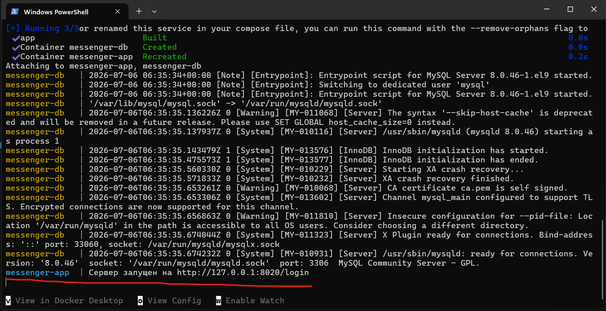

# Роадмапы и планы (на них можно нажимать)
[Backend.md](readme/Backend.md)

[Frontend.md](readme/Frontend.md)

[Report.md (отчёт для Каранандашева)](readme/Report.md)]

[Design.md](readme/Design.md)


## Запуск:


```

docker compose up --build

```
Если видите эту строку, то всё работает:



## Обнулить контейнер (если нужно перезаписать БД):

```

docker compose down -v

```
## Если нужно посмотреть БД

Подключаемся на 3307 порт, чтобы не конфликтовал с локальным MySQL
```
mysql -h 127.0.0.1 -P 3307 -u root -p
# введите пароль: example
```


<details>
<summary>Описание проекта от Ильназа (раскрывается)</summary>
окей, как я это вижу
вот что уже реализовано
сайт - мессенджер с элементами социальной сети, есть стена пользователя, на своей стене он может оставлять записи и грузить фото, можно добавлять в друзья, пользователь может написать только своему другу, можно просматривать стену другого пользователя, ну и соответственно общение между пользователями, общение сделано через сокеты, авторизация - через сессии

мы не собираемся делать соц сеть, грубо говоря у нас из соц сети только стена пользователя, итоговый продукт - удобный сервис, в котором студенты смогут полноценно общаться, создавать беседы, обмениваться фото\видео в чатах и тд, одним словом будем  создавать сервис, которым мы бы сами пользовались
</details>

# Что реализовано

- [x] Аутентификация (сессии): вход/регистрация через сессии — session.go.  
- [x] Middleware авторизации: проверка доступа к эндпоинтам — widdleware.go.  
- [x] Регистрация/логин/выход: формы и обработчики — auth.go, страницы auth.html, registration.html.  
- [x] Профиль пользователя: просмотр и редактирование профиля, загрузка аватара — handlersProfile.go, api.go, фронтенд — profile.html.  
- [x] Стена пользователя: CRUD постов (создать, список, редактировать, удалить) — handlersProfile.go и соответствующий UI.  
- [x] Друзья: добавление/список друзей, поиск пользователей — handlersProfile.go, handlersFriend.go.  
- [x] Личное общение (1:1): реальное время через WebSocket, хранение сообщений и загрузка истории чата — websocket.go, api.go.  
- [x] Фронтенд: статические страницы + Vue компонентные скрипты (/js/*) — готов базовый SPA- [x]поведение для профиля/чата.  
- [x] Статические файлы/сервер: отдача статичных ресурсов и маршрутизация — main.go.  
- [x] Модели/структуры: структуры пользователя, сообщения, стен — models.go.

# Чего не хватает
- [ ] Групповые беседы: невозможность создавать беседы более чем между двумя участниками.  
- [ ] Передача медиа в чатах: сейчас только текст; обмен фото/видео в сообщениях не реализован (есть только аватар).  
- [ ] Управление вложениями и хранилище: нет продуманного хранилища/CDN для медиа, версий/ограничений по размеру, транскодинга.  
- [ ] Уведомления и статусы: нет push/браузерных уведомлений, статус онлайн/оффлайн, индикаторы «прочитано», «печатает».  
- [ ] Поиск и рекомендация: расширенный поиск людей/чатов, сортировка, рекомендации друзей.  
- [ ] Документация и API контракт: нет явной документации API/контрактов для фронта/теста.  
- [ ] UX/мобильность: адаптивность, мобильные клиенты и удобство мобильного взаимодействия не описаны.

# Рекомендации и приоритеты (бизнес‑приоритет)
- Приоритет 1 — «Ядро продукта»:
  - Добавить обмен медиа в чатах (фото/видео) и хранение вложений — ключ для удобного общения.
  - Добавить групповые чаты/беседы (создание, управление участниками, администраторы).  
  - Реализовать базовые уведомления (браузерные) и индикатор непрочитанных сообщений.
- Приоритет 2 — «UX и рост»:
  - Онлайн/оффлайн статус, «печатает», метки «прочитано» — повышают вовлечённость.  
  - Поиск пользователей и удобная навигация по беседам.  
  - Мобильная адаптация UI и минимально приемлемый мобильный поток авторизации/чата.
- Приоритет 3 — «Операции и соответствие»:
  - Документация API, контракт фронт/бэк; базовые тесты (юнит/интеграция).  


# Приоритетные предложения по переписыванию

- WebSocket/real‑time: заменить текущую плоскую карту clients в websocket.go на централизованный hub/connection manager (очереди, mutex/конкурентность, маршрутизация сообщений, поддержка группы). Почему: повышает надёжность при росте пользователей, упрощает реализацию групповых чатов и повторных попыток доставки. Бизнес‑выгода: масштабируемая архитектура реального времени, меньше простоев при пиковых нагрузках.

- API и обработка ошибок: унифицировать API (JSON‑контракты), ответы и коды статуса; заменить разбросанные SQL‑вызовы в handlers* на слой репозитория/сервиса. Почему: облегчает поддержку фронта, тестирование и интеграции. Бизнес‑выгода: быстрее разворачивать новые фичи и меньше багов при изменениях.

- Доступ к БД / безопасность запросов: убрать неструктурированные Query/Exec вызовы по всему коду, использовать подготовленные выражения/транзакции и отдельный DAO-уровень. Почему: предотвращение ошибок, легче оптимизировать индексы и производительность. Бизнес‑выгода: стабильность и предсказуемость при росте объёмов данных.

- Frontend/API разделение: превратить текущие странички + inline Vue в чистый SPA/модульный фронт с явным API‑контрактом (фронт ↔️ бэк через JSON). Почему: улучшит мобильную адаптацию, тестирование и ускорит UX‑итерации. Бизнес‑выгода: более отзывчивый продукт, легче добавлять новые клиентские платформы.
[01.07.2026 0:39] Ильназ Загидуллин: - Тесты и CI: добавить unit/integration тесты для критичных сервисов (auth, WebSocket, загрузки файлов), настроить CI. Почему: ускоряет выпуск и уменьшает регрессии. Бизнес‑выгода: ниже стоимость поддержки, быстрее фичеролы.

# Коротко о «что начать первым»
- Быстрая победа: API‑унификация + слой репозитория (переписать 3–5 наиболее используемых эндпоинтов). Это даст быстрый ROI: фронт станет стабильнее и подготовит почву для медиа/чатов.  
- Важная инвестиция: hub для WebSocket + медиа‑хранилище — критично для конечного продукта (много общения и обмена файлами).

- Frontend/API разделение: превратить текущие странички + inline Vue в чистый SPA/модульный фронт с явным API‑контрактом (фронт ↔️ бэк через JSON). Почему: улучшит мобильную адаптацию, тестирование и ускорит UX‑итерации. Бизнес‑выгода: более отзывчивый продукт, легче добавлять новые клиентские платформы.

# Шифрование и безопасность
- В дальнейшем проекту важно перейти к защищённой передаче данных: HTTPS, безопасные cookie, защита WebSocket-соединений и контроль доступа к чувствительным данным.
- Для сообщений и личных данных стоит рассмотреть шифрование на уровне передачи и, в перспективе, end-to-end шифрование для приватных чатов.
- Также важно предусмотреть защиту файлов, контроль прав доступа к вложениям и хранение чувствительных данных с соблюдением базовых требований безопасности.


