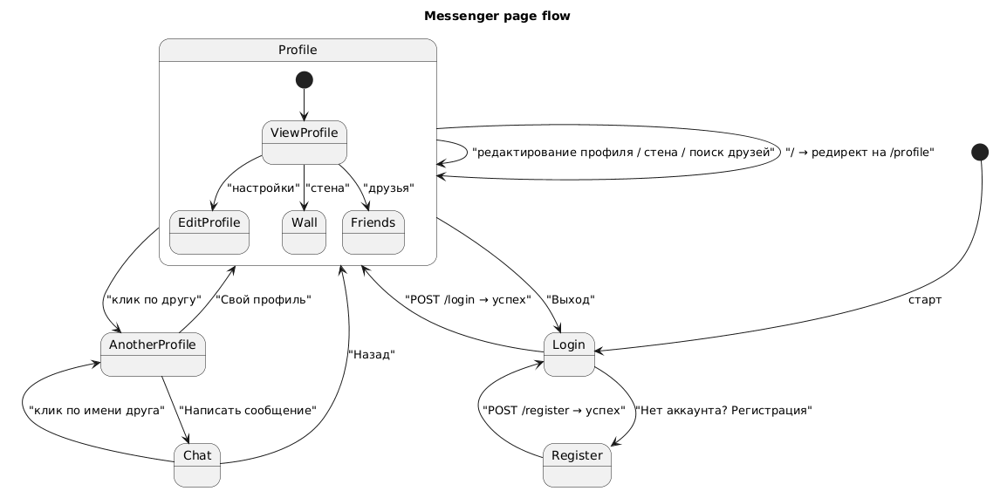

## Карта сайта

### Страницы
- `/login`
  - Страница входа.
  - Доступ: публичная.
  - Переходы:
    - После успешного входа — редирект на `/profile`.
    - Ссылка на `/register`.

- `/register`
  - Страница регистрации.
  - Доступ: публичная.
  - Переходы:
    - После успешной регистрации — редирект на `/login`.
    - Ссылка назад на `/` (аутентификация/главная).

- `/profile`
  - Личный кабинет пользователя.
  - Доступ: только авторизованным.
  - Вход из `/` и из перенаправления после логина.
  - Содержит боковую панель друзей, стену и настройки.

- `/anotherProfile.html?id={userID}`
  - Просмотр профиля другого пользователя.
  - Доступ: только авторизованным.
  - Вход из клика по другу на `/profile` или из чата.
  - Показывает чужой профиль, стену и список его друзей.

- `/chat.html?id={friendID}`
  - Личный чат с выбранным другом.
  - Доступ: только авторизованным.
  - Вход из `/anotherProfile.html` кнопкой «Написать сообщение».
  - Использует WebSocket для реального времени.

- `/`
  - Роутер в main.go перенаправляет на `/profile`.
  - Если не авторизован — сначала `/login` через middleware `auth.RequireAuth` в `HomeHandler`.

### Текущее состояние реализации страниц

#### `/login`
Реализовано:
- Форма email + пароль.
- POST `/login` проверяет пользователя в базе.
- Сохранение `user_id` в сессии.
- Редирект на `/profile`.

Что добавить:
- валидация на фронте/сервере;
- понятные ошибки для пользователя;
- восстановление пароля;
- email-подтверждение;
- блокировка входа после слишком большого числа попыток.

#### `/register`
Реализовано:
- Форма регистрации: имя, email, пароль, пол.
- POST `/register` создаёт пользователя и хеширует пароль.
- После регистрации редирект на `/login`.

Что добавить:
- проверку уникальности email на фронте и бэке;
- подтверждение email;
- правила пароля;
- капчу или защиту от ботов.

#### `/profile`
Реализовано:
- Загрузка и отображение данных профиля: имя, аватар, «о себе», пол.
- Редактирование имени и описания.
- Загрузка аватара.
- Стена: создание поста, список постов, удаление, редактирование.
- Список друзей.
- Поиск пользователя по имени.
- Добавление в друзья.
- Модальное окно уведомлений — сейчас статическое «нет уведомлений».

Что добавить:
- фронтальная лента событий / посты друзей;
- статус отношений (друг/не друг/ожидает запрос);
- полноценный поиск по друзьям / по пользователям с частичным совпадением;
- уведомления о новых сообщениях, запросах в друзья и активности;
- возможность комментировать/лайкать посты;
- публикацию медиа на стену;
- мобильно-дружелевый интерфейс;
- историю и фильтрацию постов.

#### `/anotherProfile.html`
Реализовано:
- Загрузка чужого профиля по `id`.
- Отображение имени, аватара, «о себе», пола.
- Просмотр стены другого пользователя.
- Просмотр его списка друзей.
- Кнопка «Написать сообщение» ведёт в чат.

Что добавить:
- кнопка «Добавить в друзья» или «Запрос в друзья», если ещё не друг;
- отображение статуса дружбы/коннекта;
- возможность просмотра mutual friends;
- права на контент профиля (видимость стены);
- возможность отправить сообщение сразу из профиля, если пользователь не в друзьях — с предупреждением.

#### `/chat.html`
Реализовано:
- Загрузка истории сообщений через GET `/api/message`.
- Соединение по `WebSocket` на `/ws?id={friendID}&user_id={currentUserID}`.
- Отправка текстовых сообщений.
- Отображение сообщений и времени.
- Кнопка «Назад» к `/profile`.
- Клик по имени друга ведёт обратно в его профиль.

Что добавить:
- список чатов/последних бесед;
- групповые чаты;
- загрузку фото/видео/файлов;
- статус онлайн/оффлайн;
- «прочитано» / «печатает»;
- ремонт `to_id`/`chats_id` — сейчас в UI `to_id` присваивается `chats_id`, что выглядит как баг;
- reconnect/повторное подключение WebSocket;
- обработку ошибок соединения;
- уведомления о новых сообщениях вне чата;
- оффлайн-режим и хранение локальной истории.

### Навигация между страницами

- `/login` → `/profile` после входа.
- `/register` → `/login` после регистрации.
- `/profile` → `/anotherProfile.html?id={friendID}` при клике по другу.
- `/anotherProfile.html?id={userID}` → `/chat.html?id={userID}` при клике «Написать сообщение».
- `/anotherProfile.html?id={userID}` → `/profile` по кнопке «Свой профиль».
- `/chat.html?id={friendID}` → `/profile` по кнопке «Назад».
- `/chat.html?id={friendID}` → `/anotherProfile.html?id={friendID}` при клике на имя.

### Что сейчас похоже на полноценную страницу, а что сделано как MVP

- Настройки профиля `/profile` — практически полный MVP: профиль + стена + друзья.
- Просмотр чужого профиля — реализован как базовый просмотр без взаимодействия.
- Чат — реализовано базовое 1:1 текстовое общение, но без даже элементарных UX-убеждений.
- Авторизация — работает, но без современных защит и удобств.

### Что стоит добавить на уровне карты сайта

- `/chats` — список всех диалогов. Сейчас его нет, и пользователь может попасть в чат только из чужого профиля.
- `/notifications` — отдельная страница/компонент уведомлений.
- `/search` — общая поисковая страница по пользователям/чатам/постам.
- `/settings` — центр управления профилем, приватностью, уведомлениями, паролем.
- `/groups` / `/conversations` — если планируете групповые беседы.
- `/media` / `/uploads` — если будут фото/видео чаты или галереи.

## Итог

Сейчас в сайте уже реализован основной пользовательский путь:
- регистрация → логин → профиль → просмотр друга → чат.

Но функциональность оставляет место для важных «служебных» страниц:
- каталог чатов,
- уведомления,
- настройки,
- поиск / рекомендации,
- и, в будущем, групповые беседы.

### Шифрование и безопасность
- Для пользовательских данных и сообщений стоит предусмотреть защиту канала связи через HTTPS и безопасную обработку сессий.
- В будущем можно добавить шифрование приватных сообщений, особенно для чувствительных диалогов и файлов.
- Также важно продумать защиту загрузок и управление доступом к контенту.

Если нужно, могу сразу составить упрощённую карту сайта с целью развития: текущие страницы + рекомендуемые новые страницы и приоритеты.

Searched codebase for "А можешь прям показать диаграмму перехода, дай код для plaunt uml", 19 results

## Диаграмма переходов 

### Что показывает
- `/login` и `/register` — публичные стартовые страницы
- `/profile` — основной личный кабинет
- `/anotherProfile.html?id={userID}` — просмотр чужого профиля
- `/chat.html?id={friendID}` — чат с другом
- переход `/` → `/profile` реализован редиректом